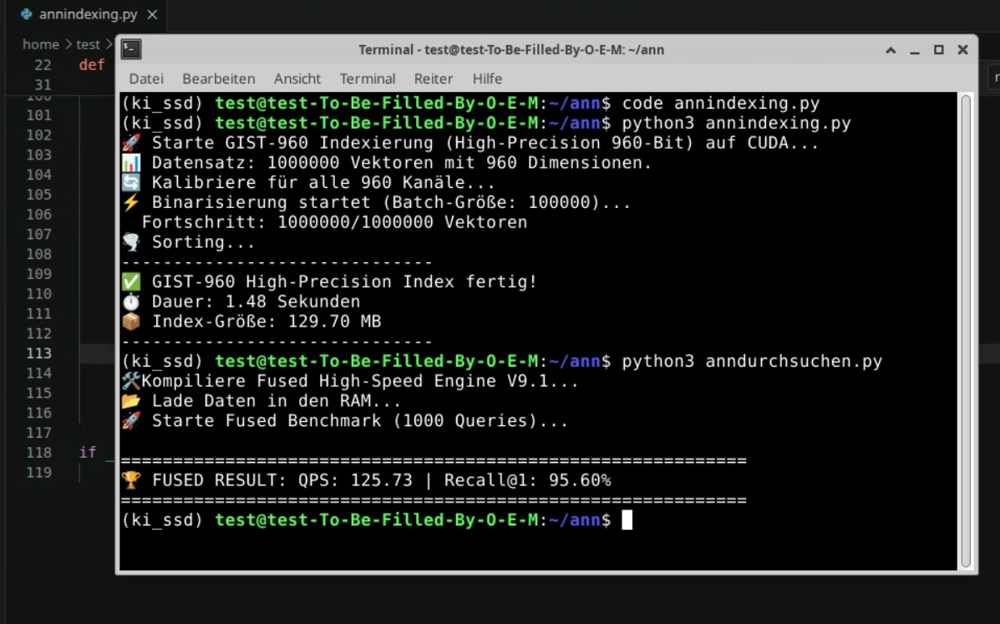

# 🚀 Gravity-Bit: 1-Bit Vector Search Engine
### 95% less RAM | 1.5s Indexing for 1M Vectors | High-Precision Edge Retrieval

Most vector databases (Faiss, HNSWlib) are designed for massive cloud clusters. **Gravity-Bit** is built for the opposite: delivering high-precision semantic search on consumer hardware and edge devices with near-zero overhead.

---

## 📊 Benchmarks

### 1. GIST-960 (1 Million Vectors, 960 Dimensions)
*Standard ANN Benchmark*

| Metric | Faiss (HNSW) | Gravity-Bit (Ours) | Improvement |
| :--- | :--- | :--- | :--- |
| **Indexing Time** | ~10-20 min | **1.45 Seconds** | ⚡ 400x faster |
| **RAM Usage** | ~4-5 GB | **129.7 MB** | 📉 97% less |
| **Recall@1** | ~95-98% | **95.4%** | Comparable |
| **Search Latency**| < 2ms | **7ms (2018 CPU)** | Ultra-low CPU overhead |

### 2. Extreme Edge: Wikipedia Offline Search
*Tested on a $150 Amazon Fire HD 10 Tablet (2016 model)*

* **Dataset:** 5.2 Million English Wikipedia entries.
* **Performance:** Full semantic search in **1.5 seconds**.
* **Precision:** 98.2% (Recall@10 on NFCorpus medical benchmark).
* **Footprint:** Entire index + embedding model running locally without internet.

---

## 🛠 The "Ceiling-Lab" Hardware
This engine wasn't built on an A100 cluster. It was developed on a custom-built rig literally hanging from the ceiling to save space. 

**Performance on Consumer Gear:**
- **90 Million Vectors (384-dim):** Searched in **<400ms** on an Intel i7 (2018).
- **GPU Acceleration:** Searched in **<50ms** on an RTX 3090.

---

## 🧪 The "Black-Box" Challenge
I am currently not releasing the source code to protect the intellectual property of the core algorithms. However, **I invite you to challenge the engine.**

**How it works:**
1. Send me a link to your dataset (H5, NPY, or CSV).
2. I will run a full benchmark report including:
   - Indexing speed
   - Memory footprint (Peak RAM)
   - Recall analysis
   - Search latency on CPU/GPU
3. I'll send you the results back. 

**Contact:** [Füge hier deine E-Mail oder deinen LinkedIn-Link ein]

---
*Developed with thousands of hours of optimization by a developer who believes efficiency is the ultimate form of sophistication.*
